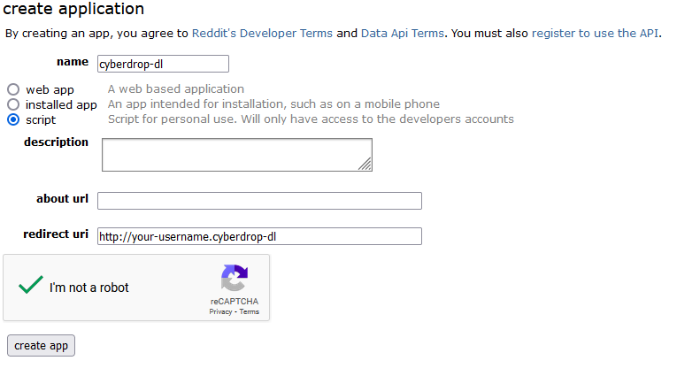
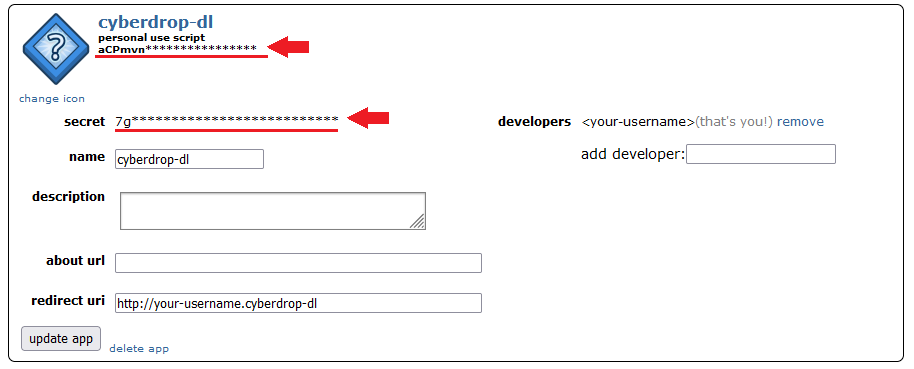

# Authentication

All the options in these list are optional. The default value for all of them is an empty `str`

| Type  | Default |
| ----- | ------- |
| `str` | `""`    |

Coomer

- `session`

Value of the `session` cookie from the website. This will allow CDL to download from your favoruites by using `https://coomer.su/favorites` as an input URL.

Kemono

- `session`

Value of the `session` cookie from the website. This will allow CDL to download from your favoruites by using `https://kemono.su/favorites` as an input URL.

Forums


Logging to forums with `Authentication` was deprecated in v6.7.0

You need to use cookie files.

See: [How to extract cookies (DDoSGuard or login errors) #839](https://github.com/jbsparrow/CyberDropDownloader/discussions/839)


GoFile

If you decide to pay for GoFile Premium (faster downloads, etc.) you can provide your API key to Cyberdrop-DL in order for the program to use it.

- `api_key`

You can get your API key here: [https://gofile.io/myProfile](https://gofile.io/myProfile)

Imgur

In order to scrape images from Imgur, you'll need to create a client on Imgur's website.

[https://api.imgur.com/oauth2/addclient](https://api.imgur.com/oauth2/addclient)

Some examples of what to put in for what it asks for:

> Application Name: `Cyberdrop-DL`
>
> OAuth2 without a callback URL
>
> Website: `https:/your_email.cyberdrop` (Any website will work, it doesn't need to actually exists)
>
> Email: `your_email@domain.com`
>
> Description: `Cyberdrop-DL client`

After generating the client above, you will need to provide these values to Cyberdrop-DL:

- `client_id`

JDownloader

Under JDownloader 2 settings -> MyJDownloader:

- `username`

- `password`

- `device`

PixelDrain

If you decide to pay for PixelDrain premium (faster downloads, etc.) you can provide your API key to Cyberdrop-DL in order for the program to use it.

- `api_key`

You can get your API key here: [https://pixeldrain.com/user/api_keys](https://pixeldrain.com/user/api_keys)

Real-Debrid

In order to download files from sites supported by real-debrid, you'll need to get the API token from your account.

- `api_key`

You can get your API key here (you must be logged in): [https://real-debrid.com/apitoken](https://real-debrid.com/apitoken)

Reddit

In order to scrape files from Reddit, you'll need to create an app on reddit's website (it's free): [https://www.reddit.com/prefs/apps](https://www.reddit.com/prefs/apps)

Select `script` as the app type. Any name can be used. For the redirect URI you can use any website, even a fake one like `http://your_username.cyberdrop-dl`. Click `create app` to get your credentials.

After generating the app, you need to provide Cyberdrop-DL these values:

- `personal_use_script`

- `secret`

Mega.nz

To enable native downloads from mega.nz (without real-debrid or j-downloader), provide these values to Cyberdrop-DL:

- `email`

- `password`

