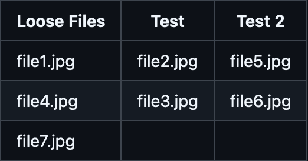

# Settings


## Browser Cookies

Cyberdrop-DL can extract cookies from your browser. These can be used for websites that require login or to pass DDoS-Guard challenges. Only cookies from supported websites are extracted

***

### auto_import


toggles automatic import of cookies at the start of each run

***

### browsers

### Supported browsers

<div align=center>

</div>


**NOTE:** If cookies exists on multiple selected browsers, the cookies from the last browser in the list will have priority



**NOTE:**  If the value entered is `null` or an empty list, no cookies will be extracted from any browser


***

### sites

List of domains to extract cookies from. Only sites supported by Cyberdrop-DL will be taken into account


**NOTE:**  If the value entered is `null` or an empty list, cookies will be extract from all supported sites


***

If cookie extraction fails, you can manually extract the cookies from your browser and save them at `AppData/Cookies/<domain>.txt`, where domain is the domain of the site you exported the cookies from. The file must be a Netscape formated cookie file


## Download Options

### block_download_sub_folders

When this is set to `true`, downloads that would be in a folder structure like:

> `Downloads/folderA/folderB/folderC/image.jpg`

will be changed to:

> `Downloads/folderA/image.jpg`

***

### disable_download_attempts

By default the program will retry a download 10 times. You can customize this, or set this to `true` (or selected) to disable it and retry links until they complete.

However, to make sure the program will not run endlessly, there are certain situations where a file will never be retried, like if the program receives a 404 HTTP status, meaning the link is dead.

***

### disable_file_timestamps

By default the program will do it's absolute best to try and find when a file was uploaded. It'll then set the last modified/last accessed/created times on the file to match.

Setting this to `true` (or selecting it) will disable this function, and those times will be the time they were downloaded.

***

### include_album_id_in_folder_name

Setting this to `true` (or selecting it) will include the album ID (random alphanumeric string) of the album in the download folder name.

***

### include_thread_id_in_folder_name

Setting this to `true` (or selecting it) will include the thread ID (random alphanumeric string) of the album in the download folder name.

***

### remove_domains_from_folder_names

Setting this to `true` will remove the "(DOMAIN)" portion of folder names on new downloads.

***

### remove_generated_id_from_filenames

Setting this to `true` (or selecting it) will remove the alphanumeric ID added to the end of filenames on some websites (ex. Cyberdrop).

Multipart archives filenames will be fixed so they have the proper pattern of their format.

Supported formats: `.rar` `.7z` `.tar` `.gz` `.bz2` `.zip`

***

### scrape_single_forum_post

Setting this to `true` will result in only a single forum post being scraped on the given link.

***

### separate_posts

Setting this to `true` (or selecting it) will separate content from forum posts into separate folders.

***

### skip_download_mark_complete

Setting this to `true` (or selecting it) will skip downloading files and mark them as downloaded in the database.

***

### skip_referer_seen_before

Setting this to `true` (or selecting it) will skip downloading files from any referer that have been scraped before. The file (s) will always be skipped regardless of whether the referer was successfully scraped or not

***

### maximum_number_of_children

Limit the number of items to scrape using a tuple of up to 4 positions. Each position defines the maximum number of sub-items (`children_limit`) an specific type of `scrape_item` will have:


1. Max number of children from a **FORUM URL**
2. Max number of children from a **FORUM POST**
3. Max number of children from a **FILE HOST PROFILE**
4. Max number of children from a **FILE HOST ALBUM**


Using `0` on any position means no limit on the number of children for that type of `scrape_item`. Any tailing value not supplied is assumed as `0`

#### Examples


Limit FORUM scrape to 15 posts max, grab all links and media within those posts, but only scrape a maximun of 10 items from each link in a post:
```powershell
--maximum-number-of-children 15 0 10

```

Only grab the first link from each post in a forum, but that link will have no children_limit:

```powershell
--maximum-number-of-children 0 1
```


Only grab the first POST/ALBUM from a FILE_HOST_PROFILE
```powershell
--maximum-number-of-children 0 0 1
```


No FORUM limit, no FORUM_POST limit, no FILE_HOST_PROFILE limit, maximum of 20 items from any FILE_HOST_ALBUM:
```powershell
    --maximum-number-of-children 0 0 0 20
```

## Files

### input_file

The path to the `URLs.txt` file you want to use for the config.

***

### download_folder

The path to the location you want Cyberdrop-DL to download files to.


## Logs

### log_folder

The path to the location you want Cyberdrop-DL to store logs in.

***

### main_log

What you want Cyberdrop-DL to call the main log file.

***

### last_forum_post

What you want Cyberdrop-DL to call the forum-post log file.

Cyberdrop-DL will store the link to the last forum posts it scraped from a given forum thread in this file.

***

### unsupported_urls

What you want Cyberdrop-DL to call the unsupported log file.

Cyberdrop-DL will output links it can't download to this file.

***

### download_error_urls

What you want Cyberdrop-DL to call the download error log.

Cyberdrop-DL will output the links it fails to download, and the reason in CSV format.

***

### scrape_error_urls

What you want Cyberdrop-DL to call the scrape error log.

Cyberdrop-DL will output the links it fails to scrape, and the reason in CSV format.

***

### webhook

The URL of a webhook that you want to send download stats to (Ex: Discord). You can add the optional tag `attach_logs=` as a prefix to include a copy of the main log as an attachment.

Example:
> `attach_logs=https://discord.com/api/webhooks/webhook_id/webhook_token`

***

### rotate_logs

If enabled, Cyberdrop-DL will add the current date and time as a suffix to each log file, in the format `YYMMDD_HHMMSS`

This will prevent overriding old log files

## File Size Limits

You can provide the maximum and minimum file size for each file "type".

This value is in bytes, but you can and an obtional suffix with the unit. Ex: `6GB`

***

* maximum_image_filesize
* minimum_image_filesize
* maximum_video_filesize
* minimum_video_filesize
* maximum_other_filesize
* minimum_other_filesize

## Ignore Options

### exclude_videos

When this is set to `true` (or selected) the program will skip downloading video files.

***

### exclude_images

When this is set to `true` (or selected) the program will skip downloading image files.

***

### exclude_audio

When this is set to `true` (or selected) the program will skip downloading audio files.

***

### exclude_other

When this is set to `true` (or selected) the program will skip downloading other files.

***

### ignore_coomer_ads

When this is set to `true`, the program will skip past ads posted by models in coomer profiles.

***

### skip_hosts

You can supply hosts that you'd like the program to skip past, and not scrape/download from. This setting accepts any domain, even if they are no supported

***

### only_hosts

You can supply hosts that you'd like the program to exclusively scrape/download from. This setting accepts any domain, even if they are no supported


## Runtime Options

These are higher level options that effect the overarching functions of the program.

***

### ignore_history

By default the program keeps track of your downloads to make sure you don't download the same things repeatedly (both for you and for the servers you're downloading from)!

Setting this to `true` will cause the program to ignore the history, and will allow you to re-download files.

***

### skip_check_for_partial_files

After a run is complete, the program will do a check to see if any partially downloaded files remain in the downloads folder and will notify you of them.

Setting this to `true` will skip this check.

***

### skip_check_for_empty_folders

After a run is complete, the program will do a check (and remove) any empty files and folders in the download and scan folder.

Setting this to `true` will disable this functionality.

***

### delete_partial_files

The program will leave partial files alone as they will be used to resume downloads on subsequent runs.

Setting this to `true` will remove any partial downloads from the download folder.

***

### send_unsupported_to_jdownloader

By default the program will not send unsupported links to jdownloader.

Setting this to `true`, will send unsupported links over.

***

### jdownloader_autostart

Defaults to `false`. Setting this to `true` will make jdownloader start downloads as soon as they are sent.

This option has no effect unless `send_unsupported_to_jdownloader` is `true`

***

### jdownloader_download_dir:

The `download_dir` jdownloader will use. A `null` value (the default) will make jdownloader use the same `download_dir` as CDL. Use this option as path mapping when jdownloader is running on a diferent host / docker.

This option has no effect unless `send_unsupported_to_jdownloader` is `true`

***

### jdownloader_whitelist

List of domain names. An unsupported URL will only be sent to jdownloader if its host is found in on the list. An empty whitelist (the default) will disable this funtionality, sending any unsupported URL to jdownloader

This option has no effect unless `send_unsupported_to_jdownloader` is `true`

***

### update_last_forum_post

Updates the `URLs.txt` file with the last scraped forum post link for each forum URL.

## Sorting

Cyberdrop-DL has a file sorted built in, but you have to enable it to use it.

You can use the shared path flags below in any part of the sorting schemas. You can also use essentially none of them and have a hard coded path. However, `filename` and `ext` must always be used.

Shared path flags:

> `sort_dir` - `sort_folder` path

> `base_dir` - the highest level folder name inside the folder being scanned, ex: (model name / thread name)

> `parent_dir` - the folder name of where the file is (album name)

> `filename` - the files name (stem)

> `ext` - the files extension

***

### Group URLs

It is possible to treat a list of URLs as a group, allowing them to be downloaded to a single folder.

To define a group, put a title above the URLs you want to be in the group by doing the following: `--- <group_name>` or `=== <group_name>`.

To define the end of a group, insert an group with no name. (`---` or `===`)

Here is an example URL file with two groups:

```
https://example.com/file1.jpg
=== Test
https://example.com/file2.jpg
https://example.com/file3.jpg
===
https://example.com/file4.jpg
--- Test 2
https://example.com/file5.jpg
https://example.com/file6.jpg
===
https://example.com/file7.jpg
```

Those downloads would be sorted as follows:
<div align="center">

</div>

***

### scan_folder

Sets the starting point for the file scan

Each direct child of the `scan_folder` is recursively scanned ,and files are moved based on your settings

If this is set to `null` (the default), `downloads_dir` is used instead

***

### sort_downloads

Setting this to `true` will allow Cyberdrop-DL to sort downloads after a run is complete.

***

### sort_cdl_only

Setting this to `true` will sort only files that were downloaded by Cyberdrop-DL. Does nothing if `sort_downloads` is set to `false`

***

### sort_folder

This is the path to the folder you'd like sorted downloads to be stored in.

***

### sort_incrementer_format

When naming collisions happen, Cyberdrop-DL will rename files (`image.jpg` -> `image (1).jpg` by default). You can change the way this is formatted. The format simply needs to include `{i}` in it to spscify where to put the auto-increment value.

***

### sorted_audio

This is the format for the directory structure and naming scheme for audio files.

Unique Path Flags:

> `length` - runtime

> `bitrate` - files bit rate

> `sample_rate` - files sample rate

***

### sorted_image

This is the format for the directory structure and naming scheme for image files.

Unique Path Flags:

> `resolution` - ex. 1080x1920

***

### sorted_video

This is the format for the directory structure and naming scheme for video files.

Unique Path Flags:

> `resolution` - ex. 1080x1920

> `fps` - ex. 24

> `codec` - ex. h264

***

### sorted_other

This is the format for the directory structure and naming scheme for other files.

### Dupe Cleanup Options

These are options for enable/disable hashing and auto dupe delection

To enable auto dupe cleanup:

1. Set `hashing` to `IN_PLACE` or `POST_DOWNLOAD`
2. Set `auto_dedupe` to `true`

***

### hashing
There are three possible options for hashing

1. `OFF`: disables hashing
2. `IN_PLACE`: performs hashing after each download
3. `POST_DOWNLOAD`: performs hashing after all downloads have completed

The default hasing algorithm is `xxh128`. You can enable aditional hashing algoritms, but you can not replace the default

***

### auto_dedupe

Enables deduping files functionality. Needs `hashing` to be enabled

This finds all files in the database with the same hash and size, and keeps the oldest copy of the file

Deletion only occurs if two or more matching files are found from the database search

***

### add_sha256_hash

allows files to be hashed with the `sha256` algorithm, this enables matching with sites that provide this information

***

### add_md5_hash

allows files to be hash with the `md5` algorithm, this enables matching with sites that provide this information.


**md5** was de default hashing algoritm of cyberdrop-dl v5. If you have a database from v5 that you would like to import into v6, is recommend to enable `md5` to match previous hashed files


***

### send_deleted_to_trash

files are sent to trash instead of permanently deleting, enabling easy restoration
