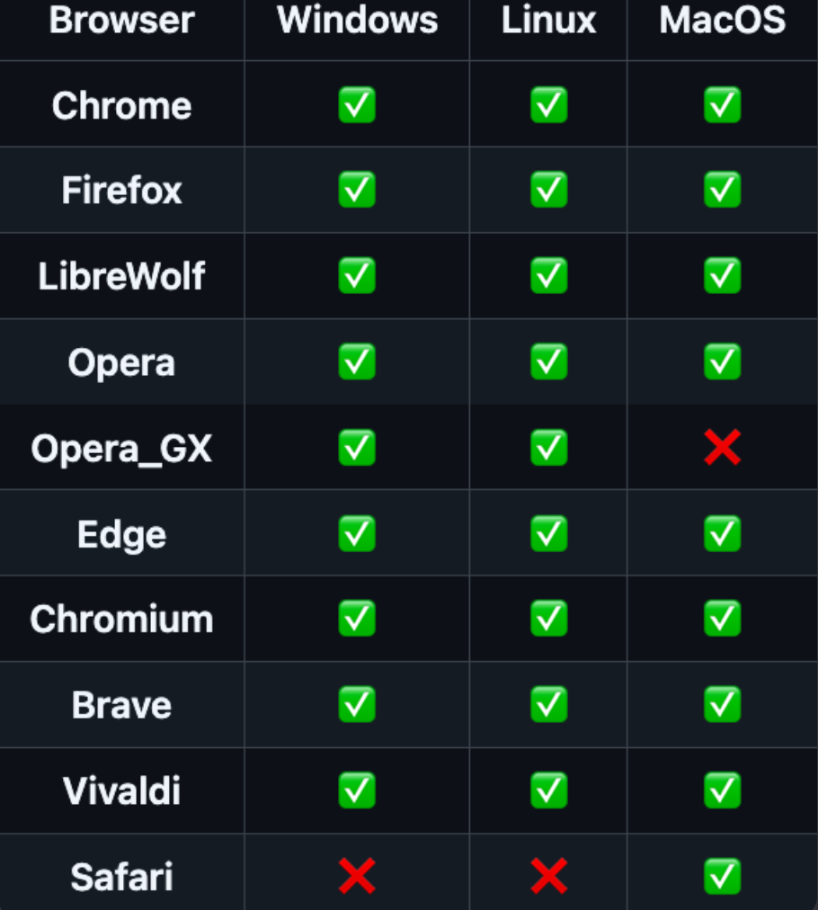

# Settings

<details>

<summary>Download Options</summary>

* block\_download\_sub\_folders

when this is set to `true` (or selected) downloads that would be in a folder structure like:

`Downloads/ABC/DEF/GHI/image.jpg`

will be changed to:

`Downloads/ABC/image.jpg`

***

* disable\_download\_attempts

By default the program will retry a download 10 times. You can customize this, or set this to `true` (or selected) to disable it and retry links until they complete.

However, to make sure the program will not run endlessly, there are certain situations where a file will never be retried, like if the program receives a 404 HTTP status, meaning the link is dead.

***

* disable\_file\_timestamps

By default the program will do it's absolute best to try and find when a file was uploaded. It'll then set the last modified/last accessed/created times on the file to match.

Setting this to `true` (or selecting it) will disable this function, and those times will be the time they were downloaded.

***

* include\_album\_id\_in\_folder\_name

Setting this to `true` (or selecting it) will include the album ID (random alphanumeric string) of the album in the download folder name.

***

* include\_thread\_id\_in\_folder\_name

Setting this to `true` (or selecting it) will include the thread ID (random alphanumeric string) of the album in the download folder name.

***

* remove\_domains\_from\_folder\_names

Setting this to `true` will remove the "(DOMAIN)" portion of folder names on new downloads.

***

* remove\_generated\_id\_from\_filenames

Setting this to `true` (or selecting it) will remove the alphanumeric ID added to the end of filenames on some websites (ex. Bunkrr).

Multipart archives filenames will be fixed so they have the proper pattern of their format.

Supported formats: `.rar` `.7z` `.tar` `.gz` `.bz2` `.zip`


***

* scrape\_single\_forum\_post

Setting this to `true` will result in only a single forum post being scraped on the given link.

***

* separate\_posts

Setting this to `true` (or selecting it) will separate content from forum posts into separate folders.

***

* skip\_download\_mark\_complete

Setting this to `true` (or selecting it) will skip downloading files and mark them as downloaded in the database.

***

* skip\_referer\_seen\_before

Setting this to `true` (or selecting it) will skip downloading files from any referer that have been scraped before. The file (s) will always be skipped regardless of whether the referer was successfully scraped or not

***

* maximum\_number\_of\_children

Limit the number of items to scrape using a tuple of up to 4 positions. Each position defines the maximum number of sub-items (`children_limit`) an specific type of `scrape_item` will have:

    1. Max number of children from a FORUM URL
    2. Max number of children from a FORUM POST
    3. Max number of children from a FILE HOST PROFILE
    4. Max number of children from a FILE HOST ALBUM

Using `0` on any position means no `children_limit` for that type of `scrape_item`. Any tailing value not supplied is assumed as `0`


Examples:

```
Limit FORUM scrape to 15 posts max, grab all links and media within those posts, but only scrape a maximun of 10 items from each link in a post:

    --maximum-number-of-children 15 0 10


Only grab the first link from each post in a forum, but that link will have no children_limit:

    --maximum-number-of-children 0 1


Only grab the first POST/ALBUM from a FILE_HOST_PROFILE

    --maximum-number-of-children 0 0 1


No FORUM limit, no FORUM_POST limit, no FILE_HOST_PROFILE limit, maximum of 20 items from any FILE_HOST_ALBUM:

    --maximum-number-of-children 0 0 0 20
```

</details>

<details>

<summary>Files</summary>

* input\_file

The path to the `URLs.txt` file you want to use for the config.

***

* download\_folder

The path to the location you want Cyberdrop-DL to download files to.

</details>

<details>

<summary>Logs</summary>

* log\_folder

The path to the location you want Cyberdrop-DL to store logs in.

***

* main\_log\_filename

What you want Cyberdrop-DL to call the main log file.

***

* last\_forum\_post\_filename

What you want Cyberdrop-DL to call the forum-post log file.

Cyberdrop-DL will store the link to the last forum posts it scraped from a given forum thread in this file.

***

* unsupported\_urls\_filename

What you want Cyberdrop-DL to call the unsupported log file.

Cyberdrop-DL will output links it can't download to this file.

***

* download\_error\_urls\_filename

What you want Cyberdrop-DL to call the download error log.

Cyberdrop-DL will output the links it fails to download, and the reason in CSV format.

***

* scrape\_error\_urls\_filename

What you want Cyberdrop-DL to call the scrape error log.

Cyberdrop-DL will output the links it fails to scrape, and the reason in CSV format.

***

* discord\_webhook\_url

The URL of the Discord webhook that you want to send download stats to. You can add the optional tag `attach_logs=` as a prefix to include a copy of the main log as an attachment.

Ex: `attach_logs=https://discord.com/api/webhooks/webhook_id/webhook_token`

***

* rotate\_logs

If enabled, Cyberdrop-DL will add the current date and time as a suffix to each log file, in the format `YYMMDD_HHMMSS`

This will prevent overriding old log files

Files that will be rotated:

| option                       | default_filename              |
|------------------------------|-------------------------------|
| download_error_urls_filename |  Download_Error_URLs.csv      |
| last_forum_post_filename     |  Last_Scraped_Forum_Posts.csv |
| main_log_filename            |  downloader.log               |
| scrape_error_urls_filename   |  Scrape_Error_URLs.csv        |
| unsupported_urls_filename    |  Unsupported_URLs.csv         |

</details>

<details>

<summary>File Size Limits</summary>

You can provide the maximum and minimum file size for each file "type".

This value is in bytes.

1 kb = 1024 bytes

1 mb = 1048576 bytes

1 gb = 1073741824 bytes

***

* maximum\_image\_filesize
* minimum\_image\_filesize
* maximum\_video\_filesize
* minimum\_video\_filesize
* maximum\_other\_filesize
* minimum\_other\_filesize

</details>

<details>

<summary>Ignore Options</summary>

Cyberdrop-DL comes equipped to ignore various files

***

* exclude\_videos

When this is set to `true` (or selected) the program will skip downloading video files.

***

* exclude\_images

When this is set to `true` (or selected) the program will skip downloading image files.

***

* exclude\_audio

When this is set to `true` (or selected) the program will skip downloading audio files.

***

* exclude\_other

When this is set to `true` (or selected) the program will skip downloading other files.

***

* ignore\_coomer\_ads

When this is set to true, the program will skip past ads posted by models in coomer profiles.

***

* skip\_hosts

You can supply hosts that you'd like the program to skip past, and not scrape/download from. This setting accepts any domain, even if they are no supported

***

* only\_hosts

You can supply hosts that you'd like the program to exclusively scrape/download from. This setting accepts any domain, even if they are no supported

</details>

<details>

<summary>Runtime Options</summary>

These are higher level options that effect the overarching functions of the program.

***

* ignore\_history

By default the program keeps track of your downloads to make sure you don't download the same things repeatedly (both for you and for the servers you're downloading from)!

Setting this to `true` will cause the program to ignore the history, and will allow you to re-download files.

***

* skip\_check\_for\_partial\_files

After a run is complete, the program will do a check to see if any partially downloaded files remain in the downloads folder and will notify you of them.

Setting this to `true` will skip this check.

***

* skip\_check\_for\_empty\_folders

After a run is complete, the program will do a check (and remove) any empty files and folders in the download and scan folder.

Setting this to `true` will disable this functionality.

***

* delete\_partial\_files

The program will leave partial files alone as they will be used to resume downloads on subsequent runs.

Setting this to `true` will remove any partial downloads from the download folder.

***

* send\_unsupported\_to\_jdownloader

By default the program will not send unsupported links to jdownloader.

Setting this to `true`, will send unsupported links over.

***

* jdownloader\_autostart

Defaults to `false`. Setting this to `true` will make jdownloader start downloads as soon as they are sent.

This option has no effect unless `send_unsupported_to_jdownloader` is `true`

***

* jdownloader\_download_dir:

The `download_dir` jdownloader will use. A `null` value (the default) will make jdownloader use the same `download_dir` as CDL. Use this option as path mapping when jdownloader is running on a diferent host / docker.

This option has no effect unless `send_unsupported_to_jdownloader` is `true`

***

* jdownloader\_whitelist

List of domain names. An unsupported URL will only be sent to jdownloader if its host is found in on the list. An empty whitelist (the default) will disable this funtionality, sending any unsupported URL to jdownloader

This option has no effect unless `send_unsupported_to_jdownloader` is `true`

***

* update\_last\_forum\_post

Updates the `URLs.txt` file with the last scraped forum post link for each forum URL.

</details>

<details>

<summary>Sorting</summary>

Cyberdrop-DL has a file sorted built in, but you have to enable it to use it.

You can use the shared path flags below in any part of the sorting schemas. You can also use essentially none of them and have a hard coded path. However, filename and ext must always be used.

Shared path flags:

> `sort_dir` - `sort_folder` path

> `base_dir` - the highest level folder name inside the folder being scanned, ex: `scan_folder` (model name / thread name)

> `parent_dir` - the folder name of where the file is (album name)

> `filename` - the files name (stem)

> `ext` - the files extension

It is possible to treat a list of URLs as a group, allowing them to be downloaded to a single folder.

To define a group, put a title above the URLs you want to be in the group by doing the following: `--- <group_name>` or `=== <group_name>`.

To define the end of a group, insert an group with no name. (`---` or `===`)

Here is an example URL file with two groups:

```
https://example.com/file1.jpg
=== Test
https://example.com/file2.jpg
https://example.com/file3.jpg
===
https://example.com/file4.jpg
--- Test 2
https://example.com/file5.jpg
https://example.com/file6.jpg
===
https://example.com/file7.jpg
```

Those downloads would be sorted as follows:


***

* scan\_folder

Sets the starting point for the file scan

Each direct child of the `scan_folder` is recursively scanned ,and files are moved based on your settings

If this is set to `null` (the default), `downloads_dir` is used instead

***

* sort\_downloads

Setting this to `true` will allow Cyberdrop-DL to sort downloads after a run is complete.

***

* sort\_cdl\_only

Setting this to `true` will sort only files that were downloaded by Cyberdrop-DL. Does nothing if `sort_downloads` is set to `false`

***

* sort\_folder

This is the path to the folder you'd like sorted downloads to be stored in.

***

* sort\_incrementer\_format

When naming collisions happen, Cyberdrop-DL will rename files (`image.jpg` -> `image (1).jpg` by default). You can change the way this is formatted. The format simply needs to include `{i}` in it to spscify where to put the auto-increment value.

***

* sorted\_audio

This is the format for the directory structure and naming scheme for audio files.

Unique Path Flags:

> `length` - runtime

> `bitrate` - files bit rate

> `sample_rate` - files sample rate

***

* sorted\_image

This is the format for the directory structure and naming scheme for image files.

Unique Path Flags:

> `resolution` - ex. 1080x1920

***

* sorted\_video

This is the format for the directory structure and naming scheme for video files.

Unique Path Flags:

> `resolution` - ex. 1080x1920

> `fps` - ex. 24

> `codec` - ex. h264

***

* sorted\_other

This is the format for the directory structure and naming scheme for other files.

</details>


<details>

<summary>Dupe Options</summary>
These are options for how to hash files from the disk
and enable/disable dupe cleanup

Files can be hashed by changing the hashing setting from 'OFF'. To enable deduplication, both the hash and dedupe settings must not be set to 'OFF'

<div style="border: 1px solid #ccc; padding: 10px; border-radius: 5px; background-color: #f9f9f9;"> <strong>Hint:</strong> All deduplication in cyberdrop-dl requires a 100 percent size match, hash match, and algorithm match</div>

<div style="border: 1px solid #ccc; padding: 10px; border-radius: 5px; background-color: #f9f9f9;"> <strong>Hint:</strong>Once a hash is in the database for a given file path file size,and hash type it  will not be recalculated</div>

* hashing
enables hashing and allows for deduplication

Value | Description
-- | -- |
`OFF` | Do not hash any file
`IN_PLACE` | Hash a file immediately after its download finishes
`POST_DOWNLOAD`| Hashes all files at once, after all the downloads have finished
***
* dedupe
*
selection for how to dedupe files
Value  |Description
-- | -- |
`OFF` | Do nothing
`KEEP_OLDEST` | Keep the oldest file for each hash, considering only the files that exist at the location saved in the database
`KEEP_NEWEST`  | Keep the newest file for each hash, considering only the files that exist at the location saved in the database
`KEEP_OLDEST_ALL`    | Keep the oldest file for each hash, considering all files regardless of whether they have been removed or moved
`KEEP_NEWEST_ALL` |  Keep the newesst file for each hash, considering all files regardless of whether they have been removed or moved
***


* add\_md5_hash
adds md5 hash when hashing files from the disk

***
* add\_sha256_hash
adds sha256 hash when hashing files from the disk
***
* send\_deleted\_to\_trash
  sends downloads to the trash folder rather than permenatly deleting off the disk
***


</details>


<details>

<summary>Dupe Options</summary>

These are options for enable/disable hashing and auto dupe delecton
***

There are two steps for auto deduplication
1. Turn change hashing to 'POST_DOWNLOAD' or 'IN_PLACE'
2. Change auto_dedupe to True


* hashing 
There are three possible options for hashing
1. OFF: disabled hashing
2. IN_PLACE: hashing after each download
3. POST_DOWNLOAD: hashing after all downloads have completed

* auto_dedupe:
  allows for deduping files when hashing is enabled
  This finds all files in the database with the same hash and size, and keeps the oldest copy of the file
  If zero or one copies of that file can be found, then no delete is performed

*


***

* keep_new_download

If enabled for each hash and size match one current file will be kept on the system

If disabled all current files will be deleted if the following is all true
- The file did not exist on the filesystem prior to the current run
- keep prev_download is set to true, this ignores if file exists on the filesystem or not
- The hash must have already existing on the system prior to the current run

Current files are files that were either downloaded or a file was skipped for already existing when dedupe_already_downloaded is true

* keep\_prev\_download
prev downloads are files that are match with the hash and size given, and are not a part of the current files list

Current files are files that were either downloaded or a file was skipped for already existing when dedupe_already_downloaded is true

If enabled then at least one existing previous download will be kept on system.
If not enabled all previous downloads will be deleted

</details>

<details>

<summary>Browser Cookies</summary>

Cyberdrop-DL can extract cookies from your browser. These can be used for websites that require login or to pass DDos-Guard challenges. Only cookies from supported websites are extracted
***

* auto\_import

toggles automatic import of cookies at the start of each run

 ***

* browsers

### Supported browsers



**Note:** If cookies exists on multiple selected browsers, the cookies from the last browser in the list will have priority


***

* sites

List of domains to extract cookies from. Only sites supported by Cyberdrop-DL will be taken into account

**Hint:** If the value entered is `null` or an empty list, cookies will be extract from all supported sites

***

If cookie extraction fails, you can manually extract the cookies from your browser and save them at `AppData/Cookies/<domain>.txt`, where domain is the domain of the site you exported the cookies from. The file must be a Netscape formated cookie file

</details>
