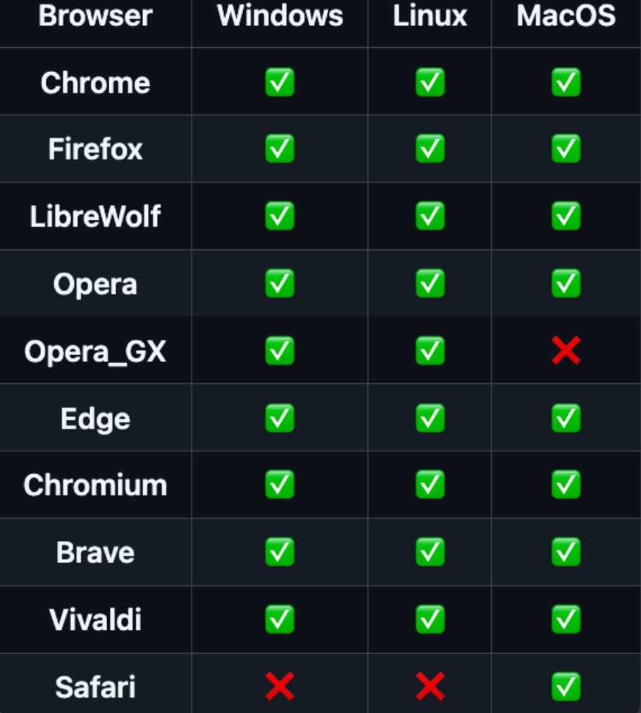

# Browser Cookies

Cyberdrop-DL can extract cookies from your browser. These can be used for websites that require login or to pass DDoS-Guard challenges. Only cookies from supported websites are extracted

##  auto_import

toggles automatic import of cookies at the start of each run

##  browsers


**NOTE:** If cookies exists on multiple selected browsers, the cookies from the last browser in the list will have priority



**NOTE:**  If the value entered is `null` or an empty list, no cookies will be extracted from any browser


##  sites

List of domains to extract cookies from. Only sites supported by Cyberdrop-DL will be taken into account


**NOTE:**  If the value entered is `null` or an empty list, cookies will be extract from all supported sites


If cookie extraction fails, you can manually extract the cookies from your browser and save them at `AppData/Cookies/<domain>.txt`, where domain is the domain of the site you exported the cookies from. The file must be a Netscape formated cookie file
